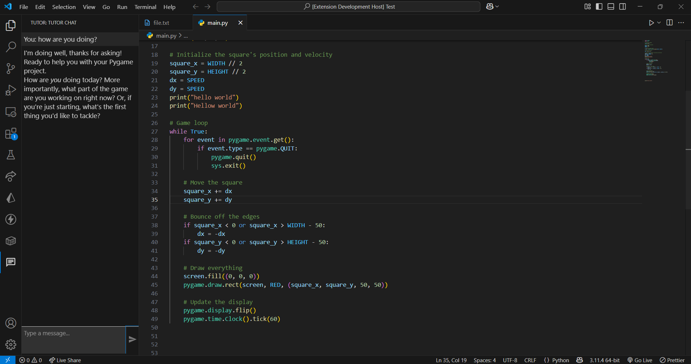

# Tutor

This extension integrates a chatbot that provides assistance and guidance, simulating the experience of interacting with a tutor. It is designed to help users by answering questions, offering explanations, and providing support for various topics.

Additionally, the extension collects telemetry data to aid in research purposes. This data helps improve the chatbot's performance and contributes to studies aimed at enhancing educational tools and user experiences. All data collection complies with privacy and ethical standards.

## Features
- Engage in interactive conversations with a chatbot to receive guidance and support.
- Get detailed explanations and answers to your questions across various topics.
- Benefit from a user-friendly interface designed for seamless interaction.
- Contribute to research by allowing anonymous telemetry data collection, ensuring privacy and ethical compliance.
- Experience continuous improvements as the chatbot evolves based on user feedback and research findings.

## Getting started

To get started with the Tutor extension, follow these steps:

1. **Install the Extension**  
    Open Visual Studio Code, go to the Extensions view by clicking on the Extensions icon in the Activity Bar on the side of the window, and search for "Tutor". Click "Install" to add the extension to your editor.

2. **Login through github**  
    After enabling the extension, you will be prompted to log in using your GitHub account. This step is necessary to authenticate the chatbot and retrieve your email address for secure access. Follow the on-screen instructions to complete the login process.

3. **Open the Chat View**  
    Click on the chat icon located in the left sidebar to access the chat view. From there, you can start interacting with the chatbot by typing your questions or requests for guidance. The chatbot will provide informative and helpful responses to assist you.

# Deployement
run: `vsce publish minor`